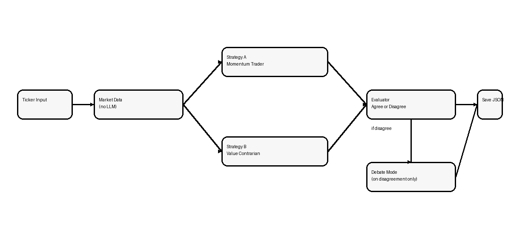

# StockTrader Report

## Strategy Selection and Rationale

This project uses **Momentum Trader** versus **Value Contrarian** as the two required core agents. I chose this pairing because the strategies interpret the same numbers in intentionally different ways. Momentum rewards continuation: price above key moving averages, supportive recent returns, and volume confirmation. Value Contrarian looks for overreaction: deep drawdowns, distance from the 52-week high, and low RSI.

I expected the strongest disagreement to appear in stocks with sharp recent declines, where one agent would treat weakness as evidence of a broken trend while the other would treat the same weakness as a buying opportunity. That expectation was borne out most clearly in TSLA and NKE. In steadier names, I expected more convergence because neither trend continuation nor mean reversion was overwhelming.

## System Architecture

The architecture follows the assignment exactly: `ticker -> market data -> two independent strategy branches -> evaluator -> optional debate -> save JSON`. Market data is fetched once with `yfinance`, then both strategies receive the same normalized feature set. Neither strategy sees the other’s output before the evaluator runs. The evaluator produces either a consensus summary or a disagreement analysis, and Debate Mode only runs when the two decisions differ.



## Stock Selection and Rationale

I used the project’s data-driven selector on the fixed candidate pool rather than choosing stocks narratively. The final set was:

- **JNJ** as the steady large-cap case because it had the strongest low-volatility and low-direction stability score.
- **XOM** as the higher-momentum case because its 90-day returns and elevated volume made it the strongest momentum candidate among the remaining names.
- **TSLA** as a recent-decline case because its 30-day return of -16.15% and 29.93% drawdown created a natural disagreement test.
- **PFE** as the sideways case because its recent returns were modest and its moving-average spread was tight.
- **NKE** as a fifth stock because it was the strongest remaining decline candidate and provided an additional high-contrast disagreement example.

## Results by Stock

| Ticker | Condition | Momentum | Contrarian | Agree? | Debate |
| --- | --- | --- | --- | --- | --- |
| JNJ | Steady large-cap | HOLD (6) | HOLD (6) | Yes | No |
| XOM | High-momentum candidate | HOLD (6) | HOLD (6) | Yes | No |
| TSLA | Recent decline | SELL (8) | BUY (8) | No | Yes |
| PFE | Sideways / low-direction | HOLD (6) | HOLD (6) | Yes | No |
| NKE | Extra sharp decline | SELL (8) | BUY (8) | No | Yes |

JNJ produced a stable agreement case. Momentum saw mildly positive alignment, but weak recent return and sub-average volume kept it at HOLD. Contrarian also stayed at HOLD because the stock sat only 2.92% below its 52-week high and RSI was 59.05, which did not look washed out.

XOM was interesting because the selector tagged it as the momentum representative, but both agents still chose HOLD. Momentum liked the longer-term trend and elevated volume, yet the current price was below the 20-day average, which reduced conviction. Contrarian also stayed neutral because RSI remained near 48.28 and the stock was only 8.89% below its 52-week high.

TSLA and NKE created the clearest disagreement cases. In both stocks the Momentum Trader recommended SELL while the Value Contrarian recommended BUY. The Debate Mode branch did not change either stance.

Two direct excerpts from the saved JSON outputs illustrate the contrast well:

```json
{
  "file": "outputs/TSLA.json",
  "field": "strategy_a.justification",
  "excerpt": "The current price of TSLA at 343.25 is below both the 20-day moving average of 376.26 and the 50-day moving average of 397.66, indicating a bearish trend. Additionally, the recent 30-day return is -16.15%, which shows significant deterioration in performance. The RSI is also low at 31.99, suggesting that the stock is oversold. Given these factors, the trend alignment is broken, and the price action is weak, warranting a sell decision."
}
```

```json
{
  "file": "outputs/NKE.json",
  "field": "strategy_b.justification",
  "excerpt": "The stock NKE has experienced a significant drop, with a recent drawdown of 36.37% and a current RSI of 18.89, indicating it is oversold. Additionally, it is currently 45.57% below its 52-week high, suggesting that there is potential for recovery. The price has decreased from $64.09 to $43.13 in the last 30 days, reflecting a strong sell-off that may present a buying opportunity."
}
```

## Patterns of Agreement and Disagreement

The broad pattern is clear: the strategies agreed on the three steadier names and split on the two heavy-drawdown names. That pattern matters more than the raw BUY/HOLD/SELL labels because it shows the strategies are genuinely behavioral rather than cosmetic.

In the agreement cases, both agents converged on HOLD for different reasons. Momentum was usually willing to acknowledge some positive structure, but not enough to issue BUY without stronger short-term follow-through. The Value Contrarian also declined to buy because none of JNJ, XOM, or PFE looked truly stretched or panicked. So agreement came from insufficient signal, not from identical reasoning.

In the disagreement cases, the same data drove opposite conclusions. TSLA had a -16.15% 30-day return, a 29.93% drawdown, and RSI at 31.99. NKE was even more extreme with a -32.70% 30-day return, 36.37% drawdown, and RSI at 18.89. Momentum treated these as evidence that weakness was still in force. Contrarian treated them as signs of market overreaction and potential mean reversion. Debate Mode did not narrow either disagreement, which suggests the split was philosophical, not just rhetorical.

## Failure or Surprise Case

The biggest surprise was **XOM**. The stock selector identified it as the high-momentum representative because its 90-day return was 36.42% and its volume ratio was 1.2555. I expected that to produce at least a mild BUY from the Momentum Trader. Instead, both agents still chose HOLD. That result is honest and useful: my selector looked more at medium-term strength, while the Momentum Trader prompt penalized the fact that price was still below the 20-day moving average. In other words, the selector and the agent were both reasonable, but they defined “momentum” on different time horizons.

## Reflection

If I had to follow one strategy for the next month with real money, I would choose the **Momentum Trader**. The reason is not that it always gives better answers, but that it is more conservative when the tape is clearly weak. In this run, the contrarian logic found attractive rebound setups in TSLA and NKE, but those same setups were exactly the places where trend damage was most severe. For a one-month horizon, I would rather risk missing the first part of a rebound than buy too early into continuing weakness.

A useful third hybrid strategy would combine the two approaches in sequence. It could first require a contrarian setup such as low RSI or a deep drawdown, then wait for one momentum confirmation signal such as price reclaiming the 20-day average or a positive volume-supported reversal. That would preserve the contrarian insight while reducing the chance of buying into a still-accelerating decline.

## Bonus Note

Debate Mode added value even though it did not change the final decisions in this run. In both TSLA and NKE, the rebuttal phase showed that the disagreement was not superficial. The Momentum Trader doubled down on broken moving-average structure and large negative 30-day returns, while the Value Contrarian doubled down on oversold RSI and deep drawdown as evidence of overreaction. What Debate Mode revealed is that the split was durable because each agent continued to privilege different parts of the same feature set. That was useful analytically: a second round did not magically resolve the disagreement, but it made the disagreement easier to diagnose. For this assignment, that is a stronger bonus result than forcing artificial convergence.
